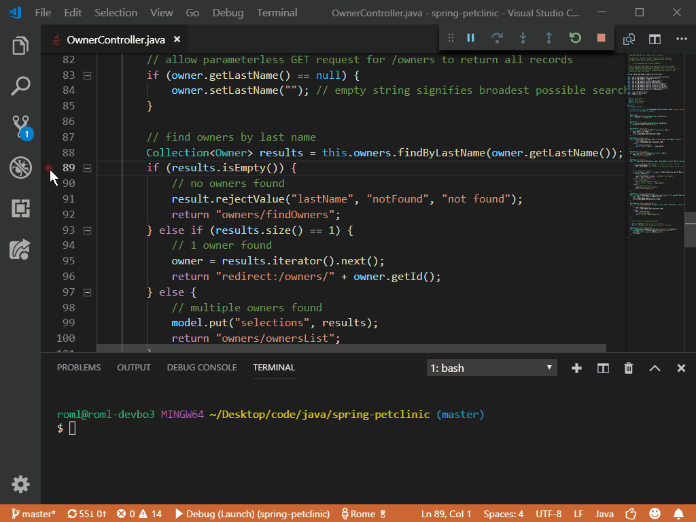
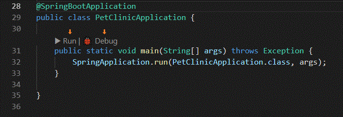
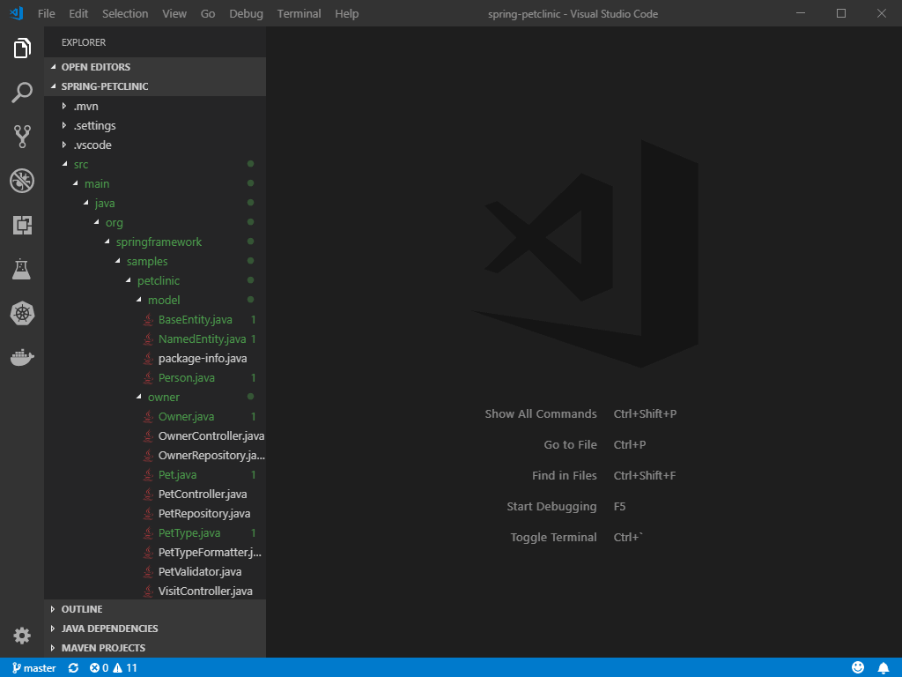

# What's new in VS Code Java?

*November 2018*

Welcome to the first issue of VS Code Java release notes. This document aims to recap the features, bug fixes around Java language support in the past month. Here are some of the key highlights:

- **[Rename refactoring](#rename-refactoring)** supports file rename/move
- **[IntelliCode](#intellicode)**, AI-assisted coding experience now supports Java
- **[Logpoints](#logpoints)** supported by the debugger
- **[Attach missing sources](#attach-missing-sources)** when debugging
- **[TestNG](#testng)** now supported by Java Test Runner
- **[Lasy load](#lazy-load)** implemented in Java Test Runner
- **[Java Dependency Viewer](#dependency-management)** released!

The release notes are arranged in the following sections releated to VS Code Java focus areas. Here are some further updates:

- **[Code Editing](#code-editing)**
- **[Debugging](#debugging)**
- **[Testing](#testing)**
- **[Dependency Management](#dependency-management)**

## Code Editing

### Rename refactoring

When a symbol is renamed, the correponding source file is also renamed along with all the references.

### IntelliCode

With the latest update of Visual Studio IntelliCode, you see recommendations (items starts with a star) on top of the default member list. Those members are recommended by looking at the current type info and the code context around it. Try the AI-assisted coding experience by installing [Visual Studio IntelliCode](https://marketplace.visualstudio.com/items?itemName=VisualStudioExptTeam.vscodeintellicode).

## Debugging

### Logpoints

Logpoints allow you to send output to debug console without editing code. They are different from breakpoints because they do not stop the execution flow of your applications. Check out this blog post for more details on [VS Code logpoints](https://code.visualstudio.com/blogs/2018/07/12/introducing-logpoints-and-auto-attach#_introducing-logpoints) feature.

### Run or debug using codelens

Don't wanna bother editing `launch.json`? This was made easy by the debugger extension. Now you can click the codelens on top of the `main` function to run or debug your application.

### Attach missing sources

`placeholder`

## Testing

### TestNG

TestNG support was added to the newest version of [Java Test Runner](https://marketplace.visualstudio.com/items?itemName=vscjava.vscode-java-test). Now you can work with TestNG in VS Code.

`placeholder`

### Enhanced JUnit 5 support

`placeholder`

### Lazy load

In the original implementation of Java Test Runner, the test case info is fully loaded during startup. This is no longer true in the latest version. Now, the loading only happens when necessary, e.g. when you expand a project to see the test classes in Test viewlet.

## Dependency Management

The long anticipated [Java Dependency Viewer](https://marketplace.visualstudio.com/items?itemName=vscjava.vscode-java-dependency) was released. Now you have a dedicated view of all the packages, classes, and other resources at your fingertip. [Try it now](https://marketplace.visualstudio.com/items?itemName=vscjava.vscode-java-dependency) if you haven't yet. Have fun!

## Notable Changes

- `Organize imports` moved to `Source Action` menu - [#513](https://github.com/redhat-developer/vscode-java/issues/513)
