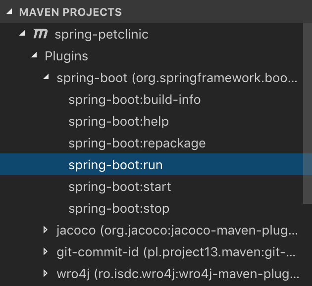

# What's new in VS Code Java?

*February 2019*

Welcome to the February 2019 release of Java Extension Pack. This document aims to recap the features, bug fixes around Java language support in between releases. Here are some of the key highlights:

- **[IntelliCode](#intellicode)** for faster coding assisted by AI
- **[Standalone Java Files](#standalone-java-files-supported)** better supported
- **[Dependency Auto-Completion](#dependency-auto-completion-for-pom.xml-files)** for editing `pom.xml` files
- **[Linting](#linting-by-checkstyle)** and **[Quick Fixes](#linting-by-checkstyle)** by CheckStyle extension
- **[Live Hover Info]()** now able to show runtime values of `@Value` annotations in Spring Boot applications

The release notes are arranged in the following sections releated to VS Code Java focus areas. Here are some further updates:

- **[Code Editing](#code-editing)**
- **[Source Code Management](#source-code-management)**
- **[Maven](#maven)**
- **[Debugging](#debugging)**
- **[Testing](#testing)**

As always, feel free to [tweet us your feedback](https://twitter.com/intent/tweet?via=code&hashtags=Java%2CHappyCoding) or [open issues](https://github.com/Microsoft/vscode-java-pack/issues).

## Code Editing

## IntelliCode

IntelliCode saves you time by putting what you’re most likely to use at the top of your completion list. IntelliCode recommendations are based on thousands of open source projects on GitHub each with over 100 stars. When combined with the context of your code, the completion list is tailored to promote common practices.

IntelliCode works well with popular Java libraries and frameworks like Java SE and Spring. It will help you whether you are doing monolithic web apps or modern microservices.

In the sample below, some of the completion lists have items marked with ★. These items are the recommendations provided by IntelliCode according to the current code context.


**Note:** TypeScript/JavaScript, Python, C++, C# and XAML are also supported.

### Linting by CheckStyle

CheckStyle extension now lints your code and offers quick fixes.

### Generate Getters & Setters

Now you can generate getters and setters for new member variables.


## Source Code Management

### Standalone Java Files Supported

We improved the support for standalone Java files. If you want to work with Java files directly but don't bother to create a project, we've got you covered.

The solution is folder based, so all you need to do is open a folder, and all the Java files inside will be properly compiled. Then you are free to run or debug them.

### Multiple Source Folder Supported

What if you have multiple sub-folders that have source code inside and want to go freestyle? We've got you covered too. Just add these folders to source path, then all the code inside will be correctly compiled.

## Maven

### Dependency Auto-Completion for `pom.xml` files

Maven extension now provides code snippet to quickly add new dependencies to `pom.xml` files. You also get auto-completion when further completing the dependency info.


### Maven Plugin Goals

Plugins and their goals are now listed in the explorer along with other Maven resources. You can execute the goals with a few clicks.



### Flat View & Hierarchical View

Maven explorer now allows you to switch between flat view and hierarchical view, to your preference.

## Debugging

### Easy Launching for Multi-Main-Class Projects


## Testing

### Test Configuration Reorganized

Test configurations are very useful in special test setups. Those configurations were originally stored in `launch.test.json`, which generated lots of confusions according to the user feedback.

We listened, and as a result, we **deprecated** `launch.test.json`, and replaced it with standard VS Code settings. Now, the test configurations stay in `settings.json`, which can be global or in at workspace level. And they look like this:

```json
"java.test.config": [
    {
        "name": "myTestConfiguration",
        "workingDirectory": "${workspaceFolder}",
        "args": [ "-c", "com.test" ],
        "vmargs": [ "-Xmx512M" ],
        "env": { "key": "value" },
    },
    {
        // Other configuration entry...
    }
]
```

For more details, visit [Test Funner Configurations](https://github.com/Microsoft/vscode-java-test/blob/master/runner-config.md).

### Navigate to Source from Test Explorer

Go to the definition of your test cases by clicking on the entries in Test Explorer.

## Happy Coding!
