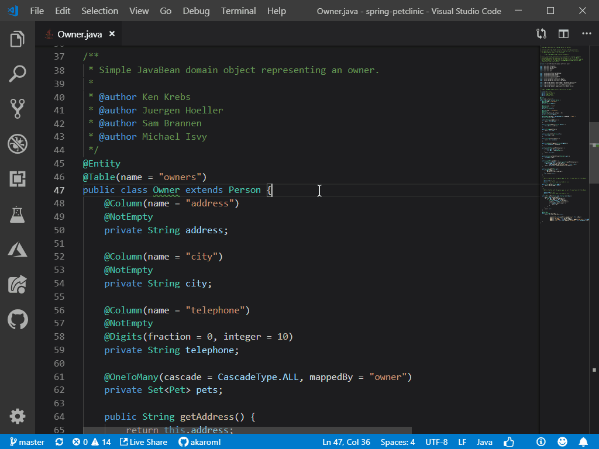
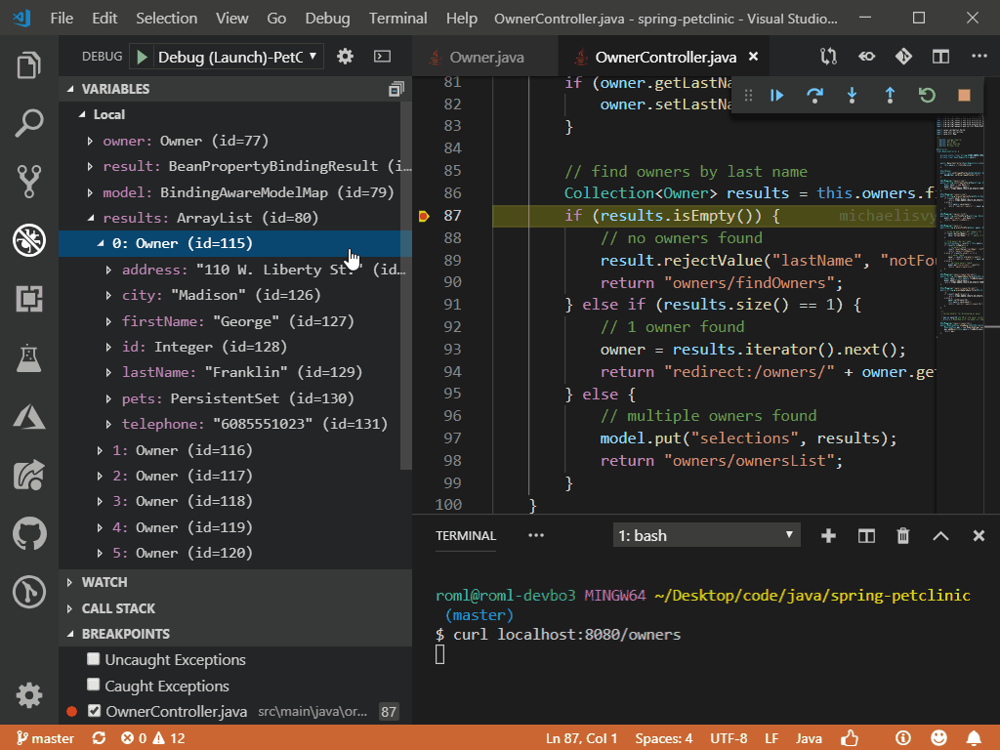
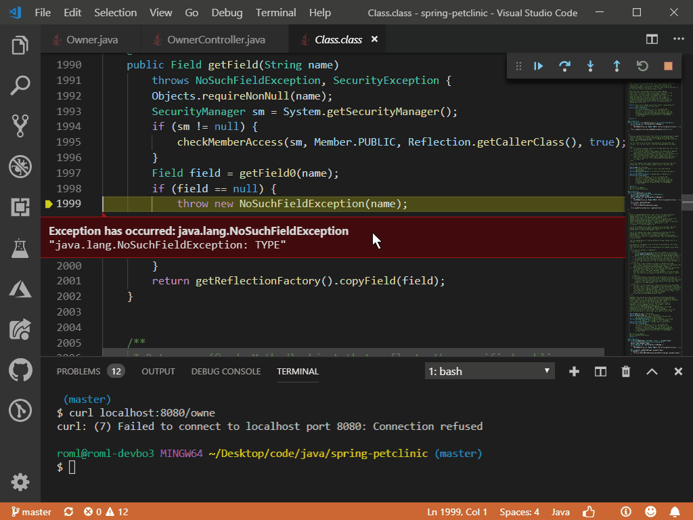

# What's new in Visual Studio Code Java?

*April 2019*

Welcome to the April 2019 release of Java Extension Pack. This document aims to recap the features, bug fixes around Java language support in between releases. Here are some of the key highlights:

- [More Source Actions](#more-source-actions) added to Java language server
- Java Debugger shows the [Logical Structure](#display-logical-structure-of-collections) of collections
- [Debugging Maven Goals](#debug-maven-goals) made easy
- [JDK Acquisition Guide] to guide you download and install Java Development Kit

The release notes are arranged in the following sections related to VS Code Java focus areas. Here are some further updates:

- [Code Editing](#code-editing)
- [Debugging](#debugging)
- [Maven](#maven)
- [Troubleshooting](#troubleshooting)

## Code Editing

### Better Performance

With the latest release of [Language Server for Java by Red Hat](https://marketplace.visualstudio.com/items?itemName=redhat.java), the performance of dealing with huge amount of source files is improved.

### More Source Actions

#### Resolve Ambiguous Imports
To deal with ambiguous imports, you now have a dropdown list to pick the right one. The code line with the unresolved type is also presented to you to help you decide.

#### Override/Implement Methods

With the new source action, all the cadidates are presented to you with a checklist. Then you can decide what to override or implement.

#### Generate `hashCode()` & `equals()`

Now `hashCode()` & `equals()` can be generated with default implementations. All the non-static member variables are listed, and you can customize the generated code using the check list.

There are two options for you to customize the generated code:
- If you use Java 7+, you can set `java.codeGeneration.hashCodeEquals.useJava7Objects` to `true` to generate shorter code which calls `Objects.hash` and `Objects.equals`.
- You can also set `java.codeGeneration.hashCodeEquals.useInstanceof` to check the object type instead of calling `Object.getClass()`.

### Folding Range

## Debugging

### Display Logical Structure of Collections
The debugger is now showing the logical structure of lists and maps, instead of the physical layout of the collections.

If you prefer the physical layout view, you can go back by setting `java.debug.settings.showLogicalStructure` to `false`.

### Highlight Exceptions in Editor
Exceptions are now highlighted with extra info in the editor window. Before that, you need to hover on the exception to see details. Now the most important info is presented to you right at where it occurs.

### Go to Definition by Clicking Stack Trace from Output

## Maven

### Debug Maven Goals
### Add Dependency Command
### Favorite Maven Commands

## Troubleshooting

### JDK Acquisition Guide

## Thank You

