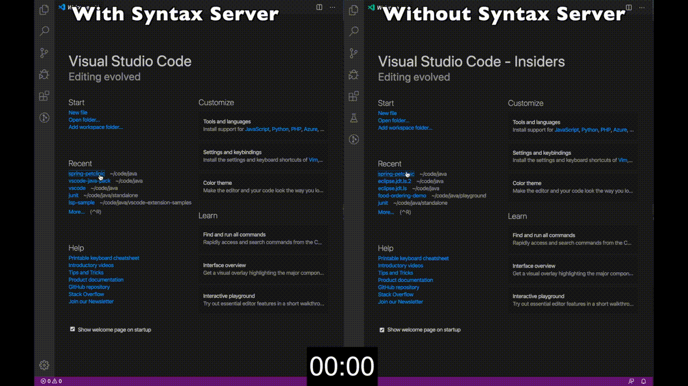
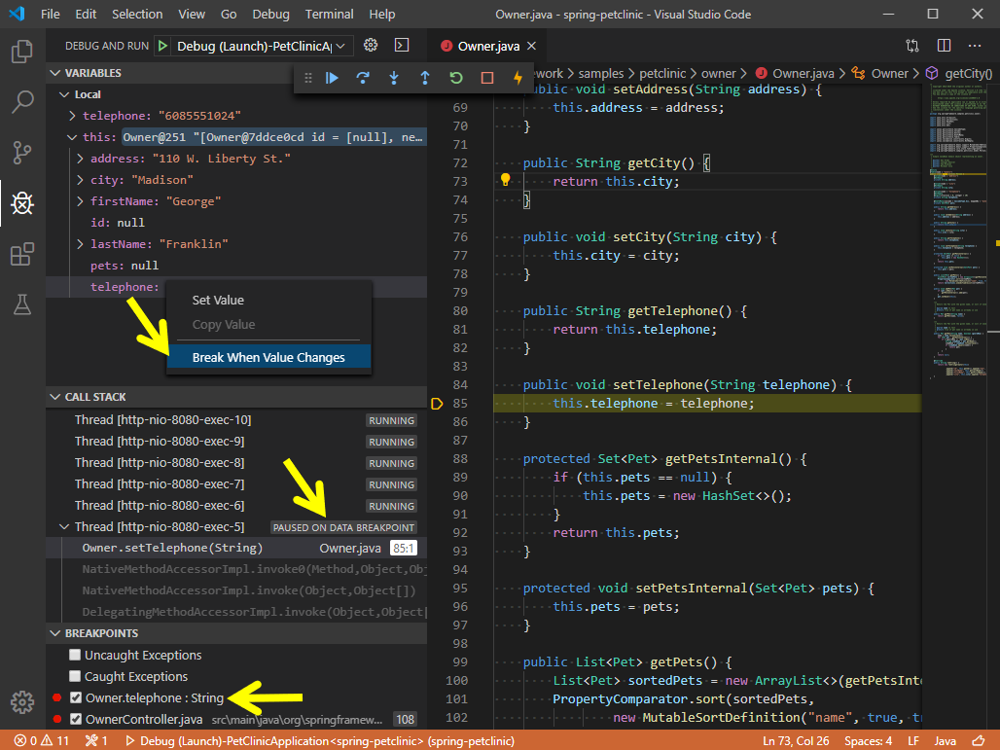
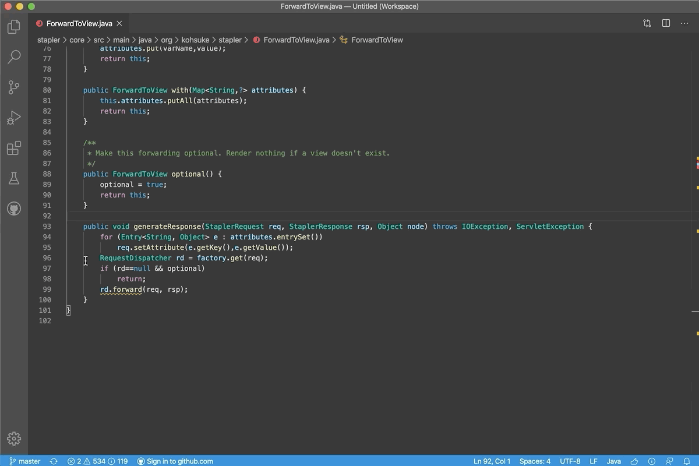
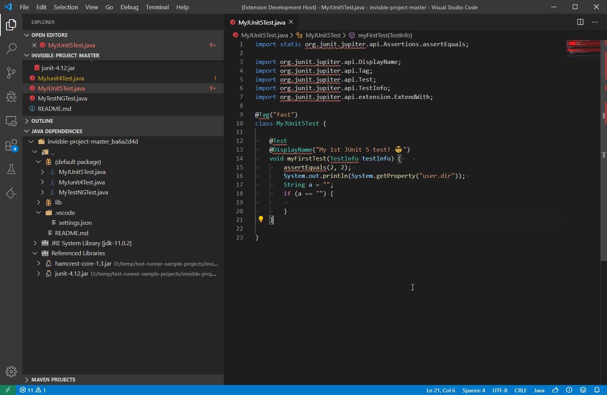
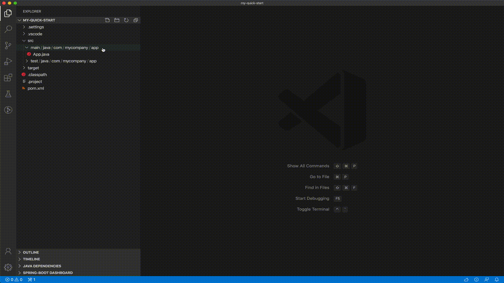
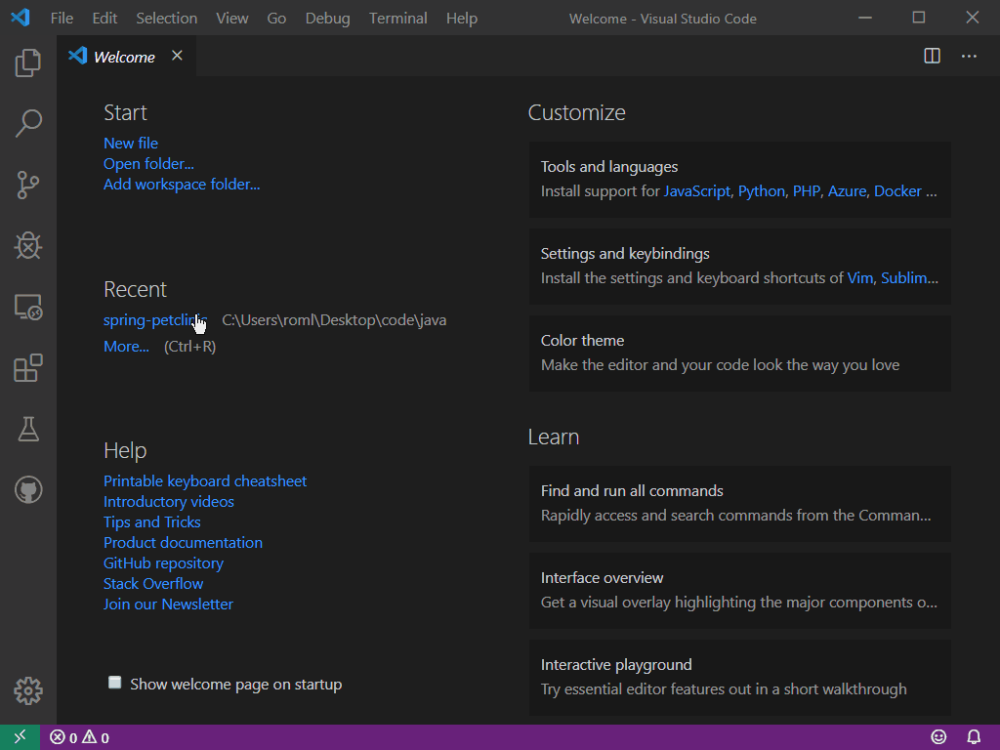
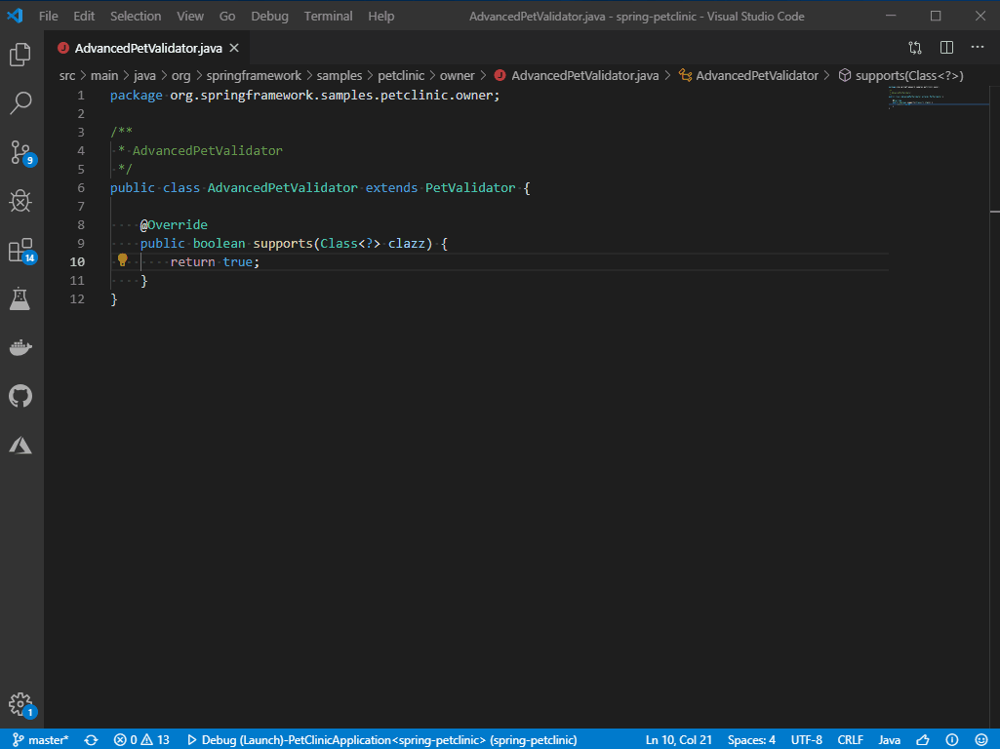

# What's new in Visual Studio Code Java?

*April 2020*

Welcome to the April 2020 release of Java Extension Pack. This document aims to recap the features, bug fixes around Java language support in between releases. Here are some of the key highlights:

- [Performance Improvements](#performance-improvements)
- [Syntax Mode](#syntax-mode)
- [Java 14](#java-14-supported)
- [Call Hierarchy](#call-hierarchy)
- [Data Breakpoint](#data-breakpoint-supported)
- [Code Actions](#more-code-actions)
- [SonarLint](#sonarlint)
- [Work with JAR Files Directly](#work-with-jar-files-directly)
- [Create New Class from File Explorer](#create-new-class-from-file-explorer)
- [MicroProfile](#microprofile)
- [Others](#others)

## Performance Improvements

The Java Language Server (the language server) has improved its speed of ***startup***, and the speed to ***import*** Maven projects. The team has been committed, and here are what they delivered so far.

### Code Navigation in 10 Seconds

Tired of waiting on the language server to start? Now the wait is over. With the help of the new Syntax Server, you will be able to use a fair amount of features within 10 seconds:



This is useful especially when you open a project for the first time. Instead of waiting for all the dependencies to be downloaded, you can use the features listed below right away:

- Syntax Highlighting & Syntax Errors
- Code Navigation (Go to Definition, etc.)
- Documentation (Hover to See Javadoc)
- Code Structures (Outline, Folding Range, etc.)

If you are interested in the technical details behind this, check out the [Syntax Mode](#syntax-mode) section.

### Download Maven Dependencies in Parallel

If you are using Maven and your project depends on lots of artifacts from Maven Central, here's a piece of good news for you. The language server now downloads Maven dependencies in parallel, and it will save you lots of time. It happens automatically when you open a Maven project so you don't need to do anything. Enjoy!

## Syntax Mode

When you drag and drop some Java files in VS Code, you probably only want to view the code, but might not be interested in the type errors. The Syntax Mode came to rescue by hiding those type errors and only reporting syntax errors. Besides that, it also parses the code and provides structure info, so you can see outlines and fold/unfold code blocks. You can tell whether you are in syntax mode by checking out this message in the `PROBLEMS` view:


Syntax Mode is more than just syntax info. It allows you to browse the known types that are defined in your *local source*, or the *JDK*. You can navigate to the definition or the references to those types, and hover to view the documentation.

However, if you do want to see all the type errors, you can switch between Syntax Mode and Full Mode by right-clicking on the warning message:


Syntax Mode is also the foundation of the performance improvement which enables Code Navigation in 10 seconds. It is tolerant and is capable of working with missing types. So in Syntax Mode, you don't have to wait for the dependencies to be resolved.

## Java 14 Supported

Java 14 is out and is supported by the language server now. To use the preview features, you may need to modify your project settings.

Maven - modify `pom.xml`:

```xml
  <build>
    <pluginManagement>
      <plugins>
        <plugin>
          <artifactId>maven-compiler-plugin</artifactId>
          <configuration>
            <release>14</release>
            <compilerArgs>--enable-preview</compilerArgs>
          </configuration>
        </plugin>
      </plugins>
    </pluginManagement>
  </build>
```

Gradle:

```groovy
sourceCompatibility = 14

tasks.withType(JavaCompile) {
    options.compilerArgs += '--enable-preview'
}
tasks.withType(Test) {
    jvmArgs += "--enable-preview"
}
```

> Note: if you are modifying a project that was already opened in VS Code before, you may need to force clean the workspace and reload. To do so, run command `Java: Clean the Java language server workspace`.

## Call Hierarchy

Call Hierarchy is supported now! To show call hierarchy info, right-click in a function body and pick "`Show Call Hierarchy`":


You can also peek the info in-place by picking "`Peek -> Peek Call Hierarchy`" instead.

And for those who are looking for *Type Hierarchy*, we are working on it and stay tuned.

## More Code Actions

Tons of new code actions have been added to make your life easier. To access them, click on the `light bulb` 💡 whenever you see it. Or right-click the editor view and pick "`Source Action...`". Here is a list of the newly added code actions:

- Move types
- Create a non-existing package
- Auto-import on paste
- Inline refactoring
- Convert for-loop to for-each loop
- Convert anonymous class to nested class
- Add `final` modifier where possible
- Remove the `final` modifier
- Remove unnecessary cast
- Assign statement to new variable/field
- Remove redundant interfaces
- Add missing case labels in `switch` statements
- Quickfix to correct access to static elements
- Quickfix for non-accessible references

## Data Breakpoint Supported

VS Code Java now supports *Data Breakpoint*, so you can have the debugger break when a variable changes its value. Please note that the data breakpoint can only be set inside a debug session. That means you need to launch your application and break on a regular breakpoint first. Then you can pick a field in the `VARIABLES` view and set a data breakpoint. See the illustration below:



## SonarLint

[SonarLint](https://marketplace.visualstudio.com/items?itemName=SonarSource.sonarlint-vscode) is a popular IDE extension that helps you detect bugs and vulnerabilities as you write code, which is widely used among Java developers. It’s available in many IDEs and now you can also use it in VS Code. This is a great [collaboration](https://github.com/SonarSource/sonarlint-vscode/pull/28) between the team members from SonarLint, Red Hat and Microsoft. The extension runs in the background and highlights code that poses a quality or security concern. Enjoy!



We’d like to encourage more developers to join us and improve Java development experience in VS Code together! If you have any idea, please submit an issue to [Java Extension Pack](https://github.com/Microsoft/vscode-java-pack).

## Work with JAR Files Directly

If you just started to learn Java and don't have any clue what Maven or Gradle is, we got you back. Now VS Code Java lets you work with JAR files directly without any build tools. Go to `JAVA DEPENDENCIES` view, find the `Referenced Libraries` node and click the `+` icon:



If you want to fine-tune this, go to `settings.json` and look for the `java.project.referencedLibraries` entry.

```json
"java.project.referencedLibraries": [
    "library/**/*.jar",
    "/home/username/lib/foo.jar"
]
```

You can tell that the glob pattern is supported. And here's more - you can  include/exclude certain files, and attach source JARs:

```json
"java.project.referencedLibraries": {
    "include": [
        "library/**/*.jar",
        "/home/username/lib/foo.jar"
    ],
    "exclude": [
        "library/sources/**"
    ],
    "sources": {
        "library/bar.jar": "library/sources/bar-src.jar"
    }
}
```

## Create New Class from File Explorer

Here to mention a new way of creating a class. Now, when you create a `.java` file in the File Explorer, the language server will automatically generate the class body, and fill the package info for you:



You can also create `interface`s, `enum`s, and `record`s in the same way.

## MicroProfile

Our friends from the Eclipse MicroProfile community published several extensions to enhance the development experience.

The [MicroProfile Extension Pack](https://marketplace.visualstudio.com/items?itemName=MicroProfile-Community.vscode-microprofile-pack) is a collection of extensions that can help develop your Java microservices using [Eclipse MicroProfile](https://microprofile.io/). You can quickly generate a MicroProfile project and utilize development tools for runtimes such as [Open Liberty](https://openliberty.io/) and [Quarkus](https://quarkus.io/).

## Others

### Check Build Status

As you code in Visual Studio Code, the language server is building your workspace to provide you the necessary language features. Now you can see the detailed build task status and understand what’s happening behind the scene by simply clicking the language server status icon.



### Go to Super Implementation

You can now keep track of class implementations and overriding methods by clicking the "`Go to Super Implementation`" link when hovering:



### Pause/Continue All/Other Threads

If you are dealing with concurrency and debugging multiple threads, the debugger makes it handy to pause/continue all/other threads. You can access this feature by right-clicking on the threads in the `CALL STACK` view in a debug session.

## Happy Coding!
